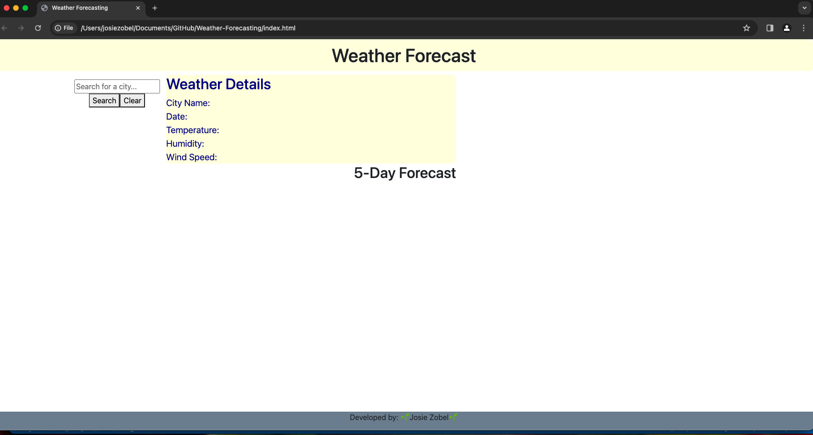
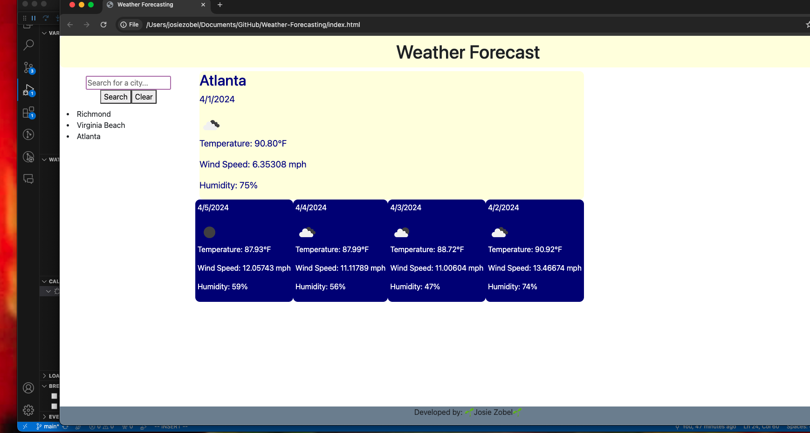

# Weather Forecast Webpage

## User Story

AS A traveler 

I WANT to see the weather outlook for multiple cities

SO THAT I can plan accordingly

## Acceptance Criteria

* ITS done when the user is presented with a weather dashboard with form inputs

* ITS done when the user searches for a city and they are presented with current and future conditions for the city and is then added to the search history

* ITS done when the user views current weather conditions for that city and are presented with the city name, the date, an icon representation of weather conditions, the temperature, the wind speed, and the humidity

* ITS done when the user can view future weather conditions for that city and are presented with a 5-day forecast that displays the information previously stated

* ITS done when the user can click on the city in the search history and again are presented with current and future weather conditions for that city

## Description

This webpage allows users to search a city and find out the weather forecast for the present day as well as a 5-day forecast. The webpage will store the previously searched cities and allow the user to look back at them easily. 

The webpage will present the user with the following information; city name, date, an icon represention of the weather conditions, the temperature, the wind speed, and humidity. This webpage will allow users to plan accordingly and be able to quickly see if any changes occur or what to expect.

## Images

